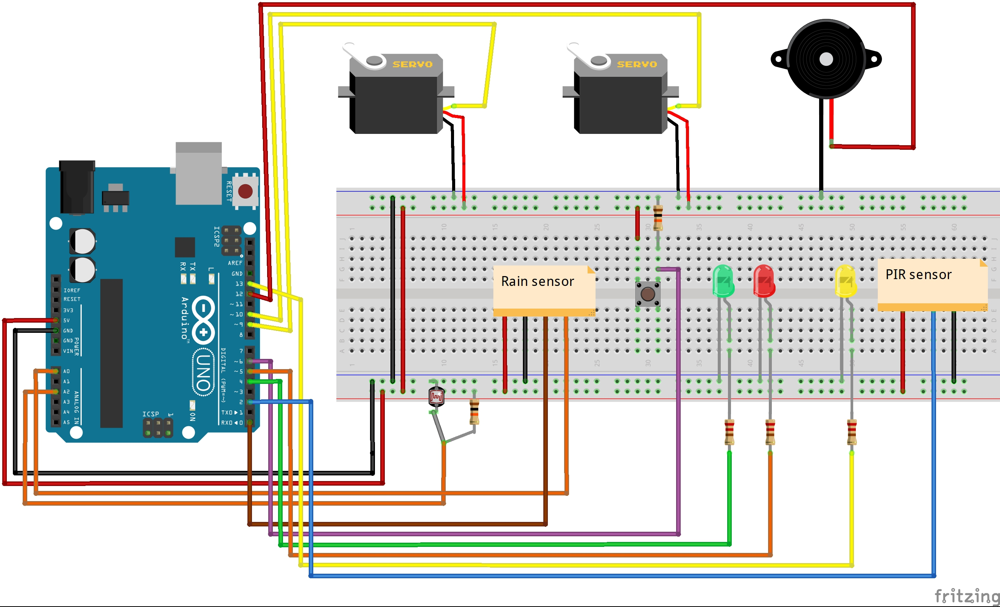

This is my final version of a project that simulate how we could make simple and cheep awning. As 
brain of this project is used Arduino Uno. Sensors and actuators used are photoresistors, PIR sensor,
rain sensor, buzzer, LED, push button and two servo motors.

This awning has both automated and manual control. Automated control is presented through detection of 
light intensity and rain falling amount. If weather is sunny and enough light is fallint to photoresitors, 
Arduino will open awning. The same will happen if we have rain.
Manual control is added to bypass cases of hail because there doesn't need to be rain or too much sun. Also,
this is good if one of our sensors is dead.

When Arduino sets commands, two servo motors open/close awingn.

Just for fun, I put PIR movement sensor which will turn on LED to light the bench that could be beneath the awning.

Beneath is scheme of the project.

Here you can see how it functions
https://youtu.be/fjNm7J8CBvk

